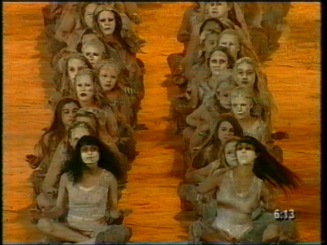



## RVTVBIMG

### Description

Ever saved a JPG or GIF you loaded into your App and then looked at the result? - this will fix that problem. This submission features capture of any GDI object on your app with a hDC (say Form or PictureBox), lets you do some simple image processing on it (eg. Flip or Resize), then allows you to colormap it, dither it and save it as a BMP or a GIF. Yes a GIF! Entirely coded in VB and presented as a DLL with extensive demo program, this could be the beginning of a great togetherware gfx processor. Contains OctTree color quantization and Remapping to MS,New or Fixed colormaps, with or without Dithering. Serious bug or idea submissions (with explain and code snippets) welcome.
 
### More Info
 
any GDI object that owns a Display Device Context (that excludes the Printer.Object sorry)

Requires areference from TESTRVTVBIMG to RVTVBIMG and the COMDLG32.OCX component (which you should have)

             |
---                |---
**Submitted On**   |2001-01-07 20:49:06
**By**             |[Ron van Tilburg](https://github.com/Planet-Source-Code/PSCIndex/blob/master/ByAuthor/ron-van-tilburg.md)
**Level**          |Advanced
**User Rating**    |5.0 (60 globes from 12 users)
**Compatibility**  |VB 6\.0
**Category**       |[Graphics](https://github.com/Planet-Source-Code/PSCIndex/blob/master/ByCategory/graphics__1-46.md)
**World**          |[Visual Basic](https://github.com/Planet-Source-Code/PSCIndex/blob/master/ByWorld/visual-basic.md)
**Archive File**   |[CODE\_UPLOAD13484172001\.zip](https://github.com/Planet-Source-Code/ron-van-tilburg-rvtvbimg__1-14210/archive/master.zip)

